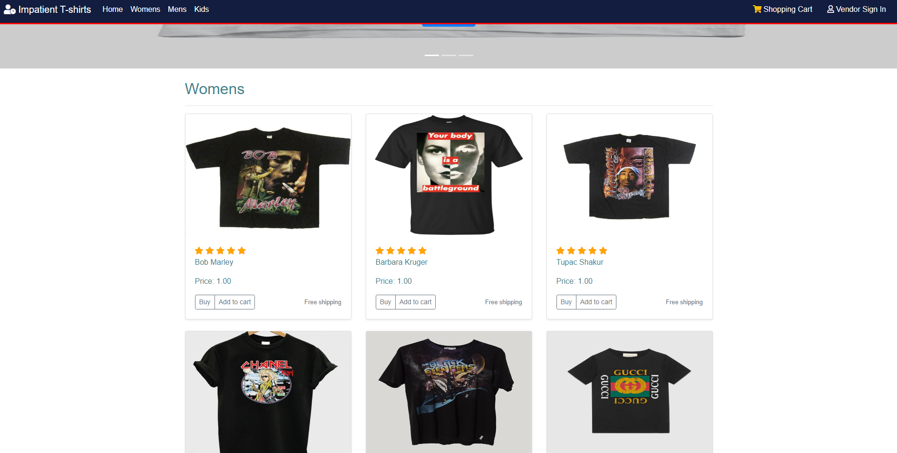
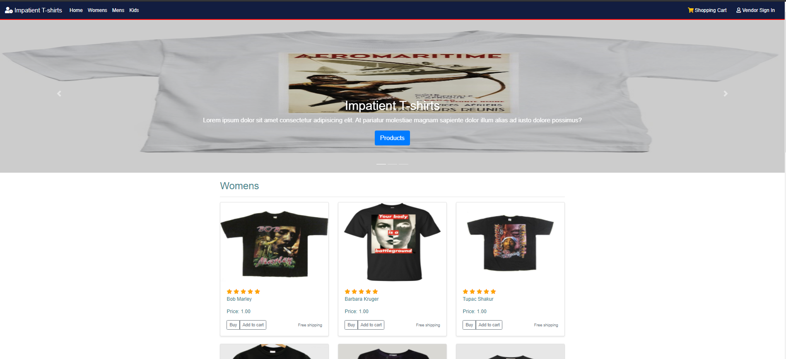

# Online-Shopping-App
This is an online shopping app


## Table of contents
- [Description](#description)
- [Installation](#installation)
- [Demo](#demo)
- [License](#license)
- [Contributors](#contributors)
- [Challenges](#challenges)
- [Technologies Used](#technologies-used)
- [Questions](#questions)


## Description
This project creates an application for online vendors to post their products to an Online Shopping Store. The vendors are able to create, update, edit and delete products from our vendor application storing product information in our Database. The information is easily retrievable to the vendor using a simple login and navigating to their own vendor account. The target user is an individual or business looking for an efficient way to sell their products.

## Installation
Be sure to use npm install and mysql2. Change the appropriate user and password in config.json file. Load schema.sql into MySQL to get the storedb database.


```
To Run: npm start
or node server.js
```
## Demo
[Deployed App in Heroku](https://floating-lowlands-34709.herokuapp.com/)


## License
[](https://opensource.org/licenses/MIT)


## Contributors
- Isatou Sanyang
- Melanie Cisler
- Nasra Hassan
- Ryan Tervo
- Ryan Ferguson

## Challenges
Setting up the login/logout Passport functionality. Merging code amongst group members to github. Adding vendor images to the database. Changing from html to handlebars.

## Technologies Used

- JavaScript
- MySQL2 
- Sequelize
- Node
- Express
- Handlebars
- Passport
- Travis CI
- Heroku

## Questions
For any other questions, please send me an email at: melanie.cisler@yahoo.com
